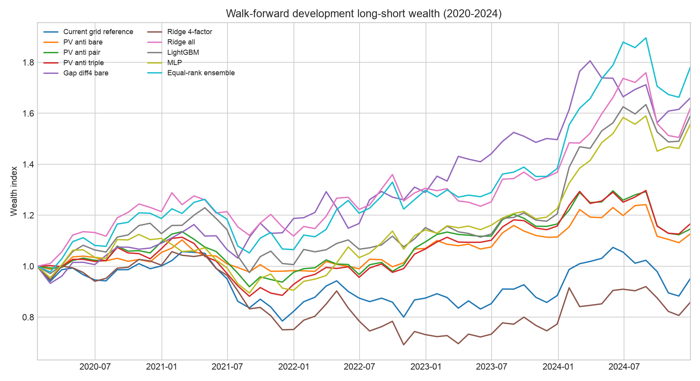

# Alpha158与机器学习复合因子报告

## 摘要

本研究在历史沪深300和中证500成分股并集上，将vn.py Alpha158价量特征、价值/规模/ROE/RSI基本面特征，以及课件中的量价反共振和隔夜—日内分解因子合并，比较Ridge、LightGBM和MLP。绩效标签仍为下一月首个交易日开盘至月末收盘收益；所有模型输出均为连续分数。

特征与调参数据限于2015—2024年。2025年没有下载或查看。2020—2024结果来自扩展式滚动开发检验，仍属于样本内开发证据，不能称为最终样本外验证。

## 数据和特征

- 数据源：米筐RQData；股票池为每个信号月末当时的历史中证800成分股。
- 特征面板：119个月、91,370个股票—月份观测。
- Alpha158：严格沿用vn.py `Alpha158`的158项命名和公式，仅在月末计算，避免存储巨大的日频宽表。
- 复权一致性：VWAP先由未复权成交额和成交量计算，再乘价格复权因子；最终`vwap/close`的1%—99%分位为约0.957—1.026，避免把送股或现金分红调整误当成预测信号。
- 公式核对：143项与本机vn.py逐项输出一致；其余15项涨跌天数统计按Alpha158公式语义计算。当前vn.py 4.4.0的DataProxy比较路径在对照样本中返回全零，因此没有复制该异常结果。
- 新增因子：`PV_ANTI_BARE/PAIR/TRIPLE`和`GAP_DIFF4_BARE`。
- 财务特征：价值、规模、ROE和RSI；先按月缩尾和标准化。
- 预测标签：下一月收益的月度截面秩，中心化为约[-1.73, 1.73]。
- 每一滚动折仅使用训练期拟合特征中位数和MAD；验证期用于Ridge正则强度选择以及树/MLP早停。
- 模型比较区间：2020—2024年；单边交易成本：10.0 bps。

## 滚动设计

| 预测年 | 训练期 | 验证年 | Ridge4 α | Ridge全特征 α | LightGBM轮数 | MLP最佳步数 | 设备 |
|---:|---|---:|---:|---:|---:|---:|---|
| 2020 | 2015—2018 | 2019 | 100 | 0.01 | 6 | 10 | mps |
| 2021 | 2015—2019 | 2020 | 100 | 0.01 | 51 | 30 | mps |
| 2022 | 2015—2020 | 2021 | 10 | 0.01 | 3 | 50 | mps |
| 2023 | 2015—2021 | 2022 | 1 | 100 | 41 | 30 | mps |
| 2024 | 2015—2022 | 2023 | 1 | 100 | 59 | 110 | mps |

同一预测年内，训练、验证和预测严格按时间先后排列。由于研究者可以在看到2020—2024汇总结果后继续修改方案，这仍是开发期内部的准样本外检验。

## 对照结果

| 方法 | 平均Rank IC | 年化ICIR | IC为正月份 | 最高组扣费年化 | 多空扣费年化 | 多空Sharpe | 多空最大回撤 |
|---|---:|---:|---:|---:|---:|---:|---:|
| Ridge/LightGBM/MLP等权秩集成 | 0.0784 | 1.917 | 72.9% | 7.49% | 12.47% | 0.877 | -16.67% |
| MLP全特征 | 0.0726 | 1.899 | 72.9% | 5.99% | 9.44% | 0.741 | -20.46% |
| Ridge全特征 | 0.0705 | 1.796 | 76.3% | 6.96% | 10.33% | 0.779 | -14.44% |
| LightGBM全特征 | 0.0680 | 1.761 | 72.9% | 5.11% | 9.91% | 0.733 | -20.70% |
| 隔夜—日内分解 | 0.0437 | 1.080 | 64.4% | 5.42% | 10.87% | 0.821 | -13.43% |
| 量价反共振×换手×振幅 | 0.0363 | 1.109 | 61.0% | 1.88% | 3.19% | 0.286 | -20.81% |
| 原35组网格参考（非严格滚动） | 0.0355 | 0.793 | 59.3% | -0.18% | -1.00% | -0.067 | -25.75% |
| Ridge四因子连续权重 | 0.0296 | 0.557 | 54.2% | 0.12% | -3.05% | -0.176 | -34.56% |
| 量价反共振×换手 | 0.0286 | 0.915 | 62.7% | 2.56% | 2.81% | 0.262 | -19.05% |
| 量价反共振（裸） | 0.0208 | 0.678 | 54.2% | 4.54% | 2.46% | 0.267 | -12.03% |

“原35组网格参考”的权重曾使用整个2015—2024年选择，因此只作直观参照，不能与滚动训练模型作完全公平的样本外比较。课件公式因子也属于已从既有课件结果中挑选的候选，不是本项目的全新盲选结果。

三模型集成不再搜索权重，而是在每个月分别把Ridge、LightGBM和MLP预测转为截面百分位秩后做等权平均；这种做法减少不同模型输出尺度的影响，也避免根据本次结果事后调权。

综合选择：将**三模型等权秩集成**作为当前主候选，因为它同时取得最高平均Rank IC（0.0784）和最高扣费多空Sharpe（0.877）；将**Ridge全特征**作为更简单的备选，因为其最大回撤较小（-14.44%）且可解释性更强。MLP证明了非线性学习可以提升排序，但不单独作为最终因子。

## 连续四因子权重

下表为五个滚动折中Ridge四因子标准化系数的均值和标准差。它直接回答“权重能否不使用0.25步长”：可以，系数由训练数据连续估计，并由下一年验证集选择正则强度。

| 特征 | 平均系数 | 折间标准差 |
|---|---:|---:|
| fund_quality | 0.0460 | 0.0105 |
| fund_rsi | -0.0019 | 0.0054 |
| fund_size | -0.0042 | 0.0046 |
| fund_value | 0.0416 | 0.0101 |

## LightGBM主要特征

| 特征 | 平均增益占比 |
|---|---:|
| max_60 | 5.90% |
| pv_anti_triple | 5.82% |
| fund_quality | 4.99% |
| gap_diff4_bare | 4.34% |
| corr_30 | 4.00% |
| fund_value | 3.98% |
| vwap_0 | 2.14% |
| vstd_20 | 2.07% |
| beta_30 | 1.89% |
| fund_size | 1.61% |
| cord_30 | 1.59% |
| vstd_10 | 1.55% |
| ksft | 1.37% |
| vstd_30 | 1.35% |
| resi_10 | 1.34% |

MLP沿用vn.py课件的PyTorch建模思路，但针对M3 Air做了适配：自动选择MPS，使用单隐藏层64单元、SiLU、5% Dropout、AdamW、L2正则和验证集早停。没有在MPS层内使用BatchNorm，因为当前vn.py实现会产生明显的同步开销；输入已在每个滚动折内使用训练期中位数和MAD完成标准化。选择小网络而非课件默认256单元，是因为本研究只有119个月度截面，必须限制模型容量，而不是因为M3算力不足。

## 解释边界

1. 深度学习的自由度更高，不应仅因训练损失更低就称为更好的因子；本报告以滚动Rank IC和扣费组合表现判断。
2. 月度股票观测并不等于独立时间样本；有效时间长度仍然有限，因此MLP结果的不确定性高于Ridge。
3. Alpha158只使用历史价量；财务指标由RQData提供，但仍需依赖供应商的历史时点口径。
4. 当前回测处理了换手成本，但没有完整模拟涨跌停、冲击成本、印花税差异和容量。
5. 2025年继续密封。只有在因子、模型和超参数冻结后，才能进行一次性最终评价。

## 可复现文件

- `model_metrics.csv`：模型和公式因子汇总指标。
- `walk_forward_predictions.csv`：2020—2024滚动预测及真实收益。
- `fold_settings.csv`：每折训练、验证、预测设置。
- `feature_importance.csv`：Ridge系数和LightGBM重要性。
- 授权原始行情及完整股票级特征位于`data/private/rqdata/`，不会提交GitHub。
