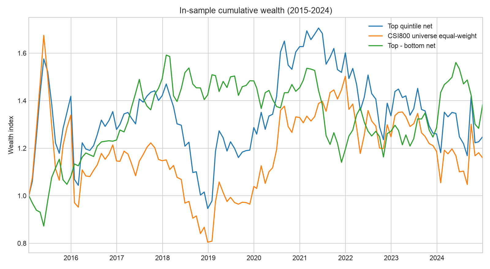
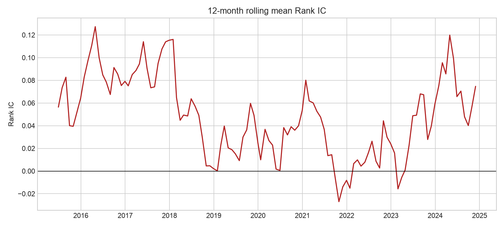

# Fama–French思路的规模—价值复合因子挖掘报告

## 摘要

本研究在历史沪深300与中证500成分股并集上，组合价值、规模、盈利质量与技术面信号。研究及调参区间为2015—2024年；2025年数据没有下载或查看。最终组合依据月度Rank ICIR从35组预先限定的权重中选择，因此所有结果均为样本内探索性证据，不构成样本外有效性结论。

样本共包含 **119** 个信号月份、**91,370** 个股票—月份观测；每月清洗后平均 **767.8** 只股票。最优复合因子平均月度Rank IC为 **0.0465**，年化ICIR为 **1.049**。Rank IC为正的月份占 **64.7%**。

## 数据和防泄漏

- 数据源：米筐RQData；历史成分股、估值财务指标、技术指标和前复权行情。
- 股票池：每个信号月末当时的沪深300和中证500成分股并集，不使用当前成分股回填。
- 信号日：月末最后交易日；收益期：下一月首个交易日开盘至下一月最后交易日收盘。
- 停牌处理：进入或退出日成交量为0的股票剔除。
- 绩效区间：2015-02-27至2024-12-31。
- 2025年保持密封；下载器通过日期策略拒绝触及2025年。

## 因子定义

- 价值：`log(book_to_market_ratio_lf)`，值越大代表估值越低。
- 规模：`-log(market_cap)`，值越大代表公司越小。
- 质量：`return_on_equity_ttm`。
- 技术：`RSI10`。
- 每月先按1%和99%分位缩尾，再使用 `vnpy.alpha` 做截面Z标准化。
- 因子方向按2015—2024年样本内平均Rank IC确定；这是明确记录的样本内调参。

| 因子 | 原始平均Rank IC | 采用方向 |
|---|---:|---|
| value | 0.0429 | 正向 |
| size | -0.0074 | 反向 |
| quality | 0.0213 | 正向 |
| technical | -0.0163 | 反向 |

## 权重搜索

四项权重限定为非负、总和为1、步长0.25，共比较35组。选择目标是年化Rank ICIR，不直接以累计收益挑选。最终组合为：

| 因子 | 权重 | 方向 |
|---|---:|---|
| value | 0.25 | 正向 |
| size | 0.00 | 反向 |
| quality | 0.50 | 正向 |
| technical | 0.25 | 反向 |

排名前10的候选如下；完整表见 `ff3_combo_candidates.csv`。

| 价值 | 规模 | 质量 | 技术 | 平均IC | 年化ICIR | 多头年化收益 | 多空年化收益 |
|---:|---:|---:|---:|---:|---:|---:|---:|
| 0.25 | 0.00 | 0.50 | 0.25 | 0.0465 | 1.049 | 2.26% | 3.33% |
| 0.50 | 0.00 | 0.25 | 0.25 | 0.0505 | 0.883 | 3.57% | 4.64% |
| 0.50 | 0.00 | 0.50 | 0.00 | 0.0503 | 0.875 | 3.69% | 3.35% |
| 0.25 | 0.00 | 0.75 | 0.00 | 0.0391 | 0.862 | 3.05% | 2.14% |
| 0.25 | 0.25 | 0.25 | 0.25 | 0.0440 | 0.850 | 3.35% | 2.09% |
| 0.25 | 0.00 | 0.25 | 0.50 | 0.0369 | 0.811 | 0.62% | 1.44% |
| 0.25 | 0.25 | 0.00 | 0.50 | 0.0357 | 0.768 | 1.55% | 1.89% |
| 0.50 | 0.00 | 0.00 | 0.50 | 0.0393 | 0.745 | 2.11% | 2.97% |
| 0.75 | 0.00 | 0.25 | 0.00 | 0.0483 | 0.743 | 5.74% | 4.02% |
| 0.75 | 0.00 | 0.00 | 0.25 | 0.0452 | 0.730 | 4.90% | 4.12% |

最优组合的Rank IC普通t检验为 **t=3.302, p=0.0013**；对月度序列使用3阶Newey–West/HAC标准误后为 **t=3.305, p=0.0009**。仅针对35组权重搜索作Bonferroni上界校正后，p值为 **0.0332**；该校正没有完全覆盖因子方向选择，因此仍应视为探索性证据。

逐年Rank IC如下。2021年为负，说明稳定性并非无条件成立。

| 年份 | 平均Rank IC | 月数 |
|---:|---:|---:|
| 2015 | 0.0645 | 12 |
| 2016 | 0.0791 | 12 |
| 2017 | 0.1153 | 12 |
| 2018 | 0.0023 | 12 |
| 2019 | 0.0250 | 12 |
| 2020 | 0.0536 | 12 |
| 2021 | -0.0082 | 12 |
| 2022 | 0.0241 | 12 |
| 2023 | 0.0587 | 12 |
| 2024 | 0.0505 | 11 |

## 组合回测

每月按复合得分分为五组，等权持有一个月。交易成本按单边 **10.0 bps**、依据实际组合换手率扣除；收益未包含印花税差异、冲击成本和涨跌停无法成交的进一步约束。

| 组合 | 年化收益 | 年化波动率 | Sharpe（无风险利率按0） | 最大回撤 |
|---|---:|---:|---:|---:|
| 最高分组（成本后） | 2.26% | 23.22% | 0.097 | -39.95% |
| 最高组减最低组（成本后） | 3.33% | 14.25% | 0.234 | -28.34% |
| 股票池等权基准（未扣成本） | 1.50% | 24.53% | 0.061 | -51.97% |

五分组的未扣成本年化收益如下。Q4高于Q5，说明收益排序并非严格单调；不能仅凭平均IC把该组合描述为成熟交易策略。

| 分组 | 年化收益 | 年化波动率 | 最大回撤 |
|---|---:|---:|---:|
| Q1 | -3.69% | 27.62% | -68.44% |
| Q2 | 1.55% | 25.94% | -53.98% |
| Q3 | 1.69% | 24.81% | -55.02% |
| Q4 | 4.53% | 23.86% | -39.54% |
| Q5 | 2.81% | 23.22% | -38.83% |

## 解释与局限

1. 本结果允许在2015—2024年内反复比较方向和权重，因此存在多重检验和样本内过拟合风险；不能把最优组合的收益当成未来保证。
2. 2025年尚未启封，报告不包含样本外验证。因子和成本假设冻结后，如课程需要，只能对2025年进行一次性评价。
3. 股票池限于历史中证800成分股，结论不能直接外推到微盘股或全部A股。
4. 当前成交模型已避开同日收盘成交并剔除首尾停牌，但尚未逐笔模拟涨跌停、冲击成本和容量。
5. `book_to_market_ratio_lf`、ROE和RSI由RQData提供；报告公开汇总指标，不提交原始授权数据或License。

综合判断：该复合因子在样本内呈现统计上的横截面排序信息，但最高分组收益较低、回撤较大、五分组不完全单调。它可以作为课程作业中的“已完成因子挖掘候选”，但不应描述为已经达到实盘可用标准。

## 可复现文件

- `ff3_combo_candidates.csv`：全部35组权重及指标。
- `ff3_combo_monthly_returns.csv`：最优组合月度汇总收益和换手率。
- `ff3_combo_rank_ic.csv`：最优组合月度Rank IC。
- 原始股票级面板位于 `data/private/rqdata/`，受许可约束且被Git忽略。
